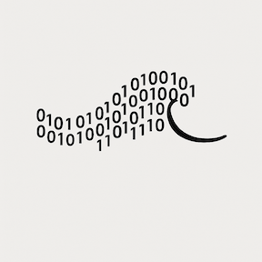

# Splash

**Splash** is an **LLM analysis framework built on [Structured Wave Geometry (SWG) and Structured Coherence Geometry (SCG)](https://github.com/whelmed/structured_wave_geometry.git)**.
It provides tools to **analyze, visualize, and regulate coherence** in large language models by projecting hidden states into a geometric space of invariants.

---

## Why Splash?

Modern LLMs are powerful but fragile. They drift, hallucinate, loop, or collapse into incoherent states.
**Splash** tackles this by bringing **geometry-based diagnostics** to LLMs:

- **Invariant measures** — entropy, curvature, alignment, dislocation, flux.
- **Dashboards & plots** — coherence maps, layer curves, dislocation heatmaps.
- **Control policies** — temperature/top-k regulation, adaptive decoding.
- **Calibration & profiling** — thresholds tuned for stability and robustness.
- **Robustness testing** — perturbation and paraphrase analysis.

In short: Splash is **how you make coherence visible and actionable in LLMs**.

---

## Package Overview

- **`adapters.py`** — Interfaces for Hugging Face, API clients, and custom models.
- **`orchestrate.py`** — High-level entry points for evaluating prompts and hidden states.
- **`types.py`** — Core dataclasses for hidden states, invariants, and evaluation runs.
- **`scg/`** — Geometry core (curvature, entropy, flux, projection, dynamics).
- **`geometry.py`, `layers.py`, `curves.py`** — Hidden-state analysis functions.
- **`dashboard/`** — Visualization: coherence dashboards, invariant grids, heatmaps.
- **`control/`** — Policy, controller, and actuator modules for runtime LLM regulation.
- **`robustness.py`** — Perturbation testing (synonyms, paraphrases, distractors).
- **`roi_miner.py`** — Region-of-interest mining for episodes and traces.
- **`train_dynamic.py`** — Training routines for dynamic adapters.

---

## Use Case

Splash is designed as a **research and monitoring framework for LLM coherence**:

- Detect **collapse fingerprints** in LLM hidden states.
- Visualize **how coherence evolves across layers and tokens**.
- Run **dashboards** that highlight when an LLM is drifting or looping.
- Apply **control policies** that intervene in decoding when collapse is imminent.
- Compare **robustness across prompts, perturbations, or models**.

Other domains (physics, biology) provided inspiration, but Splash’s focus is **language models**.

## Installation

```bash
git clone https://github.com/whelmed/splash.git
cd splash
pip install -e .
```
